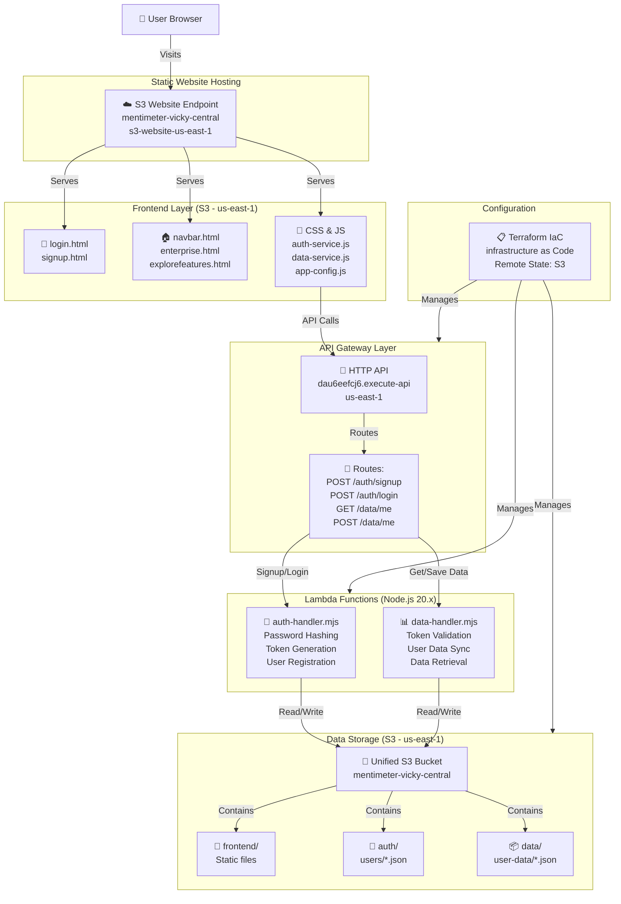
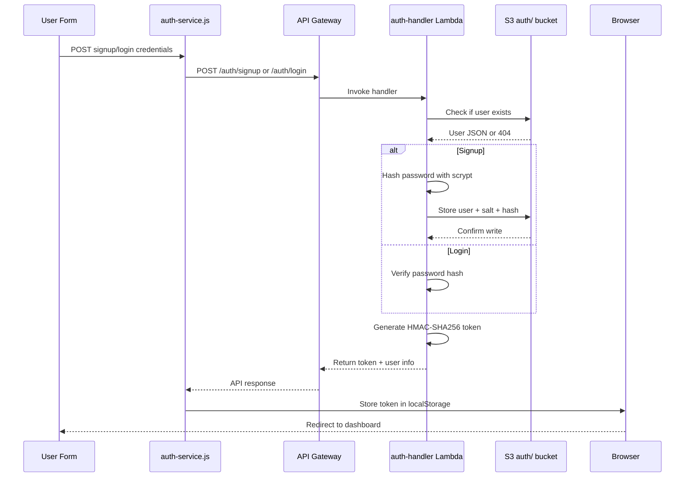
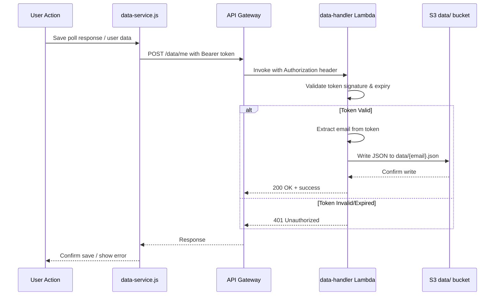
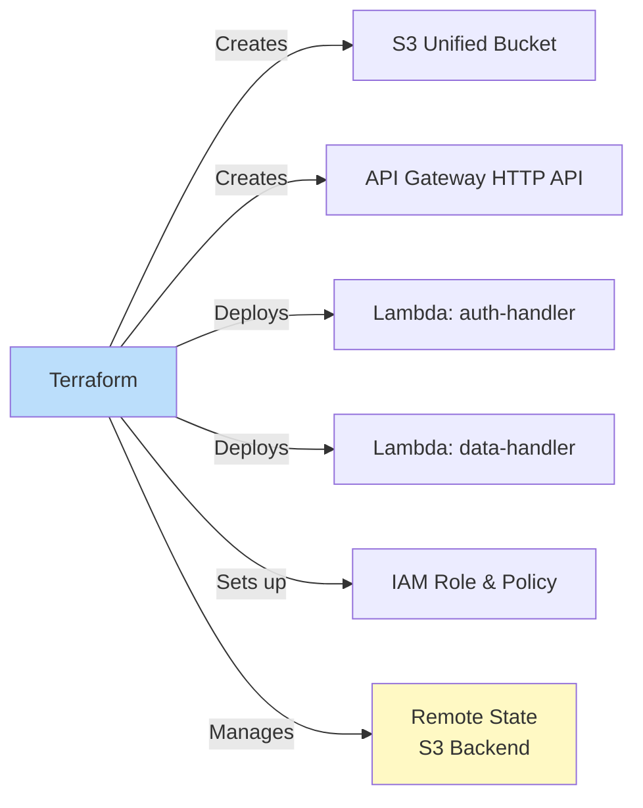

# Mentimeter Architecture Flow

## System Overview



---

## Authentication Flow



---

## Data Persistence Flow



---

## Storage Organization

```
mentimeter-vicky-central-20260321/
├── frontend/              ← Static site files
│   ├── login.html
│   ├── signup.html
│   ├── navbar.html
│   ├── enterprise.html
│   ├── explorefeatures.html
│   ├── *.css files
│   └── *.js files
│
├── auth/                  ← User credentials
│   └── users/
│       ├── user1@email.json
│       └── userN@email.json
│
└── data/                  ← User poll data
    └── user-data/
        ├── user1@email.json
        └── userN@email.json
```

---

## API Endpoints

| Endpoint | Method | Purpose | Authentication |
|----------|--------|---------|-----------------|
| `/auth/signup` | POST | Create new user | None |
| `/auth/login` | POST | Authenticate user | None |
| `/data/me` | GET | Fetch user data | Bearer token required |
| `/data/me` | POST | Save user data | Bearer token required |

---

## Security Features

🔐 **Password Hashing**: Scrypt with random salt (16 bytes)  
🔑 **Token Security**: HMAC-SHA256 signed, 8-hour expiry  
✅ **Token Validation**: Signature verification on every request  
🛡️ **Data Isolation**: Each user's data stored by email key  
⚙️ **IAM Least Privilege**: Lambda only accesses auth/* & data/* prefixes  
📍 **CORS Configured**: Localhost + S3 domain whitelisted  

---

## Terraform Infrastructure



---

## Region & Endpoints

| Resource | Region | Endpoint |
|----------|--------|----------|
| S3 Bucket | us-east-1 | mentimeter-vicky-central-20260321 |
| Static Site | us-east-1 | mentimeter-vicky-central-20260321.s3-website-us-east-1.amazonaws.com |
| API Gateway | us-east-1 | https://dau6eefcj6.execute-api.us-east-1.amazonaws.com/prod |
| Terraform State | us-east-1 | vs-terraform-workspace (S3 backend) |

---

**Status:** 🟢 Production Ready  
**Created:** March 21, 2026
